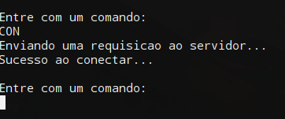

# FTP-SERVER-Python

# Funcionamento
  O seguinte programa simula um servidor e um cliente FTP, foi escrito usando a versão do python 2.7 com sockets. 
  
  **Ao inicia-lo você pode fazer:**
  * Upload dos arquivos do cliente pro servidor
  * Download dos arquivos do servidor pro cliente
  * Listar os arquivos da pasta do servidor
  * Navegar entre diretorios remotos usando CD e CD..
  
  **Para iniciar o programa**
   * Você tem que abrir dois prompts de comando para inicializar o programa, pois um ficará responsável pelo *Cliente* e o outro pelo *Servidor*.
  
  **Area Inicial**
   * Ao iniciar o cliente você terá essa tela inicial:
   
   

  * E ao iniciar o servidor você terá essa tela inicial:
  
   
   
 **Conexao**
  * Quando um cliente quer se conectar com o servidor ele deve digitar *CON*, que é enviada uma requicição de conexão ao servidor.
  
  
  
  
  
  **Upload e Download**
    * Para que fazer o *Upload* do Cliente pro Servidor, o arquivo deve está dentro da pasta do Cliente, e para se fazer um requisição de upload é necessário digitar a opção "UPLD" na área do cliente, seguido do nome do arquivo que você deseja upar.
    
    ```
    Entre com um comando:
    UPLD arquivo.txt
    ```
    
   
   O arquivo que foi enviado pelo upload vai parar na pasta */Arquivos* que está dentro da pasta do servidor
   
   * Para se fazer o *Download*, é necessário que o Cliente faça uma requisicão de download digitando "DWLD" e logo após o arquivo que se deseja baixar, obviamente que este arquivo deve estar dentro da pasta /Arquivos
   
   ```
   Entre com um comando:
   DWLD arquivo.txt
   ```
   
   **List**
   * Caso você não saiba qual arquivo baixar, você pode enviar uma requicição "LIST" para o servidor, que listará as pastas que estão dentro da pasta do servidor. Você pode também navegar nas pastas remotas,usando CD para entrar em uma pasta e CD .. para voltar ao diretório anterior.
   * List Cliente
   
   
   
   * List Servidor
   
   
   
   * CD Cliente
   
   
   
   * CD Servidor
   
   
   
   
